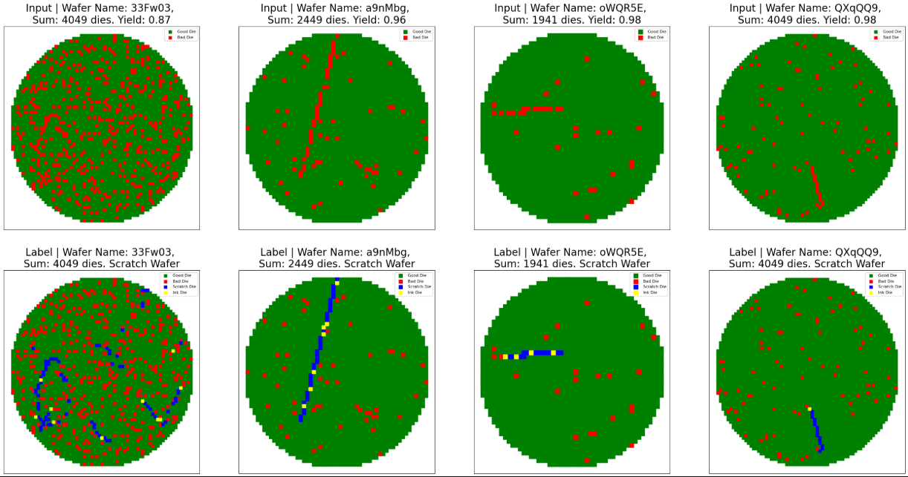

# 🧠 Wafer Scratch Detection using U-Net Segmentation

Detecting scratches on semiconductor wafers is a **rare-defect detection** problem where spatial patterns are crucial.  
This project reframes the task as a **binary segmentation** problem: each wafer is converted into a 71×71 grid, and a compact U-Net model is trained to localize scratches at the die level.

---

## 📌 Project Overview

- 🧭 **Problem Reframing:** Converts tabular die-level manufacturing data into 2-D grid representations to capture spatial context.  
- 🏗 **Model:** Compact U-Net segmentation network tailored for structured defect localization.  
- ⚖️ **Class Imbalance Handling:** Uses weighted binary cross-entropy loss and `pos_weight` to emphasize rare positive pixels.  
- 🎯 **Threshold Selection:** Sweeps precision, recall, and F1 on validation to choose a balanced decision threshold (0.97), with optional temperature scaling for calibration.  
- 📊 **Evaluation:** Focuses on F1, precision and recall instead of accuracy, since scratches are rare events.

---

## 📊 Results

| Metric      | Value |
|------------|------:|
| **F1 Score**   | 90% |
| **Precision**  | 87% |
| **Recall**     | 93% |
| **Threshold**  | 0.97 |

These results were obtained on the **validation split**.  
The **test set is unlabeled** and is used only for qualitative visualization and inference.

---

## 📥 Dataset

The dataset is hosted externally due to GitHub’s file size limits.

👉 [**Download the dataset from Google Drive**](https://drive.google.com/drive/folders/1BGn3-MfPQiVNroxg_TVVKhZ1KvzlC75j?usp=sharing)

## 🧠 Key Takeaways

- Reframing the data representation is often **more impactful** than changing the model architecture.  
- Handling **class imbalance carefully** is essential for rare-defect detection.  
- Validation-based thresholding and **proper metrics** (F1, AUPRC) give a realistic view of model performance.  
- Segmentation models can be successfully applied to manufacturing data by leveraging **spatial structure**.

📌 **Author:** Moneer Ghanem  
Computer Science & Computational Neuroscience Student
🔗 [LinkedIn](https://linkedin.com/in/moneerghanem)
